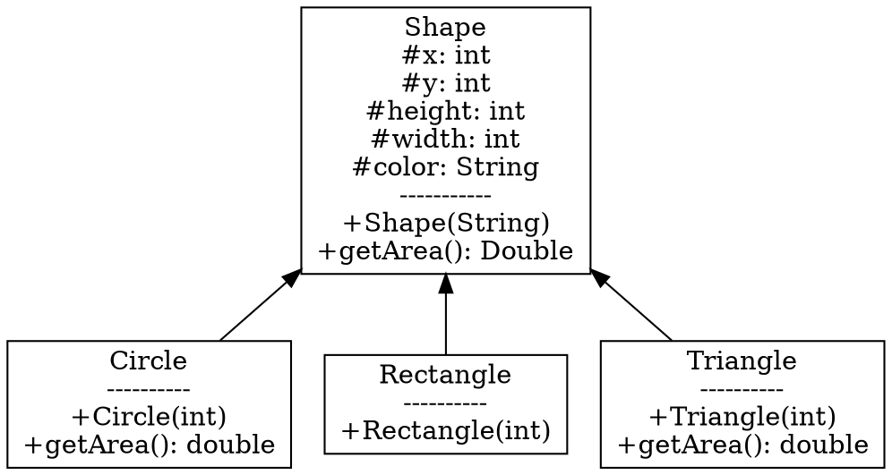

# CSE 271 Notes

## Citation
Notes written by Brian Egolf and adapted from Dr. Rao's (Miami University CSE Department) CSE 271 Slides. All code examples taken from slides.

## Table of Contents 

**[Java Classes](#Java-Classes)**<br>
**[UML](#uml)**<br>
**[Type Casting](#type-casting)**<br>
**[Abstract Classes](#Abstract-Classes-and-Methods)**<br>
**[Interfaces](#interfaces)**<br>
**[Unit Testing and Debugging](#Unit-Testing)**<br>
**[Recursion](#Recursion)**<br>
**[Sorting and Complexity](#Sorting-and-Complexity)**<br>
## Java Classes  

4 pillars of object-oriented programming:

- Abstraction
- Polymorphism
- Inheritence
- Encapsulation

Encapsultation: Ability to encapsulate all neccessary variables and functions.

Abstraction: Ability to hide details of how the class operates.

Inheritence: Ability to inherit variables and functions from a parent class.

Polymorphism: Child class can override parent class function.

When we have a parent class that does not have enough information to implement
the functions in it, we have two options. 1. return null or dummy variables
until we gain the information. 2. Make the class abstract.

In Java classes, each class must have a constructor. A constructor is a method
that creates the object of said class. It is defined as follows

```public ClassName(){}```

The ```ClassName``` of the constructor must be the EXACT same as the class file
name and the class name. The example constructor is one that that takes in no
variables and does noting in the body. It is possible to make multiple constructors
to handle different construction scenarios. Take the following class as an example

```java
public Class Fruit{
    private double cost;
    private double weight; 
    private int amount;

    public Fruit(){};
    public Fruit(int amount, double cost, double weight){
        this.cost = cost;
        this.amount = amount; 
        this.weight = weight;
    }
}
```

This is a class named ```Fruit``` with a few private instance variables and two
constructors. The two constructors tell us that we can construct on object of
type ```Fruit``` in two different ways. We can either pass in no variables or
three variables.

What we can also do is this:

```java
public Class Fruit{
        private double cost;
        private double weight; 
        private int amount;

        public Fruit(){
        this(0,0.0,0.0);
    };

    public Fruit(int amount){
        this(amount,0.0,0.0);
    };

    public Fruit(int amount, double cost){
        this(amount, cost, 0.0);
    }
        
    public Fruit(int amount, double cost, double weight){
                this.cost = cost;
                this.amount = amount; 
                this.weight = weight;
        }
}
```

Here we see that the constructor can call a method named ```this```. This means
that the method will call the constructor but with whatever variables are passed
into the ```this``` method. Thus, when 0 parameters are passed, the program will
go into the ```Fruit()``` constructor, see that I called ```this(0,0.0,0.0)```
and execute the ```Fruit(int amount, double cost, double weight)``` constructor.

This is useful when there are many different ways that a person can construct
an object and there are many variables to fill.

Another tool that java allows is called the ```super``` command. This allows
a programmer to call the constructer in a parent class. Look at the following
example.

```java
public class Food(){
        public Food(int num, String type){};
}
```

```java
public class Fruit() extends Food{
        public Fruit(){
            super(0,"strawberry");
        }
}
```

As you can see, the ```Fruit``` class extends the ```Food``` class. This means that
```Fruit``` is a child of ```Food```. ```Fruit``` inherits instance variables and functions
of ```Food``` and when we call the constructor in ```Fruit``` the ```super``` call will call
the constructor in the class above (the parent), in our case the ```Food``` class. A person
can only call ```this()``` OR ```super()``` NOT both. You can however call a ```this()``` and
in a different constructor call ```super```.

### Pros and Cons of OOP

|    pros    |    Cons    |
|------------|------------|
|    Better Organization for methods and variables    |   Not great for small programs     |
|    Effective programming design for APIs            |     Steeper learning curve    |
|    Allows for quicker reuse of existing code        |      Troubleshooting can be more difficult   |
|    polymorphism allows for more customization of functionality | Polymorphism introduces runtime overhead|
|    Reduces cost of code maintenance | OOPs tend to be larger than procedural programs |

## UML

-: private

+: public

\#: protected

~: package access

->: From child to parent (solid line)
-->: From class to interface (dashed line)

Example:

This example will not render unless using enhaced markdown viewer in VS code. Use [this link](http://magjac.com/graphviz-visual-editor/) to view the graph in browser using the DOT language viewer. Just copy and past the below code into the left side of the screen.




## Type Casting

Upcasting: From child class to parent class. ```Parent p = child;```

This is a "safe" type cast becasue if a child reference is valid, then the parent reference has to valid.

Downcasting: From parent to child class. ```Child c = (parent) p;```

This is "unsafe" because there is no guarantee that a parent reference points to a valid child object. This
can casue a runtime exception.

```instanceof``` operator return boolean of if an object is an instance if a certain class.
Returns True if the specified class is present in teh descendents.

comparing objects can be as easy as using ```.equals()``` method. The method takes in another object
and compares to the implicit parameter ```this```.

## Abstract Classes and Methods

Slanted chars in UML. Abstract classes are incomplete classes. They do not have all the info that they need.

```public abstract String getName()```

The derived classes will override this. Abstract method has to have the abstract identifier, no body and the class,
must also have the abstract identifier before ```class``` tag. If there is ONE abstract method, the class must become
abstract as well. You cannot instantiate an abstract class.

```java
public abstract class Thing{
   public Thing(){}

   public static void main(){
        Thing th = new Thing();
   }
}
```

This is invalid and cannot be done since ```Thing``` is abstract.

## Interfaces

When a class needs to implement more than 1 functions from a given class, you can use interfaces. Interfaces are defined as follows:

```java
public interface example {
 public void sayHi();
}
```

Now we can create a class that extends another class AND implements the interface like this:

```java
public class myClass extends mySuperClass implements example{
    public void sayHi(){
        System.out.println("Hello World");
    }
}
```

All methods in an interface MUST be abstract. This is by definition. That way each class that implements it, can override those methods.

### Clone

Java has a ```clonable```interface. This interface has no functions. Example usage:

```java
public class Person implements clonable {
    public Person clone() {
        return Person(this);
    }
}
```

There are two types of copying data: Shallow and deep copies.

### Shallow Copies

Shallow copies reuse the object references. This means that if I make 3 shallow copies of an object and change a value in one of them, then that value will be changed for all 3 copies.

Example:

```java
public class Student implements
Cloneable, Comparable<Student> {

    protected String name;
    protected int[] scores;

    public Student(Student src) {
        this.name = src.name;
        this.scores = src.scores;
    }

    @Override
    public Student clone() {
        return new Student(this);
    }
}
```

### Deep Copies

Deep copies creates new objects and copies the values. This will create separate objects so a change in object 2 will not affet object 1. This increases memory usage.

Example:

```java
public class Student implements
Cloneable, Comparable<Student> {

    protected String name;
    protected int[] scores;

    public Student(Student src) {
        this.name = src.name;
        this.scores = Arrays.copyOf(src.scores,src.scores.length);
    }

    @Override
    public Student clone() {
        return new Student(this);
    }
}
```

## Unit Testing

Two types of errors:

- Semantic errors: Logic errors, will compile but program output is not what is expected. Hard to debug, usually need debugger.
- Syntax errors: Error in how one wrote the code. Will not compile, easier to find. Might need documentation to fix.

Different types of testing:

- Unit testing: Test methods and classes.
- Functional testing: Test functionality of features.
- Regression testing: Aims to detect if existing features are broken.
- Integration testing: Tests interoperability between software systems.
- Performance testing: Tests speed, response time, scalability etc.

It is impossible to test a program completly. Typically 80% coverage is the standard. Testing DOES NOT prove the abscence of errors in code. Simply means they have not been found yet. It is impossible to test every set of inputs to a method or class so you should focus on edge cases and outliers that are most likely to expose bugs.

Unit testing is when one looks for errors in an isolated subsystem. Java provides a class called ```JUnit``` which provides the framework for testing java code. Typically when creating a class,
a programmer will create the class i.e. ```exampleClass``` and also create a testing class ```exampleClassTester```. Inside the tester class will be different methods for testing different cases and
methods in the developed class. ```JUnit``` provides the assert statements to try and find the errors in the code.

### JUnit Methods

|   Methods   |   Description   |
|-------------|-----------------|
| ```assertTrue(test)``` | Fails if test is false.|
| ```assertFalse(test)``` | Fails if test is true.|
| ```assertEquals(expected, actual)``` | Fails if expected is not equal to actual.|
| ```assertSame(expected, actual)``` | Fails if expected is not same as actual (by ==)|
| ```assertNotSame(expected,actual)``` | Fails if expected is same as actual (by ==)|
| ```assertNull(value)``` | Fails if value is not null.|
| ```assertNotNull(value)``` | Fails if value is null. |
| ```fail()``` |  Causes current test to immediately fail.|

You can add error messages to the above tests by adding a string to the input parameters as follows:

```assertEquals("The two objects failed the equals unit test", expected, actual)```

It is often neccessary to test for exceptions below is an example.

```java
@Test(expected=ArrayIndexOutOfBoundsException.class)
public void testMethod() {
    ArrayList<Integer> list = new ArrayList<Integer>();
    list.get(4);
}
```

You can also test for timeouts which are useful for infinite loop scenarios.

```java
@Test(timeout = 500)
public void methodToTest(){
    int i = 0;
    while(true){
        i++;
    }
}
```

### How to use JUnit in Eclipse

- Right Click on class in project overview window
- Select ```Other``` at bottom of pop up menu.
- Select ```JUnit 4 test``` Option.
  - Optionally, you can select the class from this menu at the bottom of the screen.
- Select methods for testing.
- Select ```Coverage as``` option once you right click on the class agian.
- Select the ```JUnit Test``` option.
- View Report.


## Recursion 

The main idea behind recursion is to use answers from previous solution to find solution of current question. Recursion is perfect for problems that contain identical sub-probelms. A recursive method calls itself! The method usually calls itself with different parameters. There are two types: self-recursion and mutual recursion. 

Self recursion:
```java
public static int recur(int a) {
    recur(a-1)
}
```

Mutual Recursion:
```java

public static int a(int j){
    b(j-1)
}
public static int b(int i){
    a(i-1)
}
```

A recurisve method needs to have two parts: the base part and the recursive part. The base part consists of ```if``` statements that will excute and stop the method from calling itself. This is important since if there is no base case part, the method could be in an infinite loop. The recursive part is self explainitory and this is the part that calls itself over and over until the base case is executed.

Example of recursive method:
```java
staticvoidwriteVertical(intn) {
    if(n < 10) {
    // 1 digit number!
    System.out.println(n);
    } else{
    writeVertical(n / 10);
    System.out.println(n % 10);
    }
}
```

Another example:
```java
static int power(int x, int n) {
    if (n > 0) {
        // working your way down to a base case via the n variable
        return (power(x,n-1) * x)
    } else {
        return 1
    }
}
```

Comparison to iterative approach:

Iterative example:
```java
static String reverse(String str) {
    String rev = "";
    for(inti = str.length() - 1; i >= 0; i--) {
        rev = rev + str.charAt(i);
    }
    return rev;
}
```

Recursive example:

```java
static String reverse(String str) {
    if(str.length() == 1) {
    return str;
    }
    return reverse(str.substring(1)) + str.charAt(0);
}
```

Other probelms that recurision is great for is searching. Binary search is typically a recursive method. 
## Sorting and Complexity

Recursion can also be used to sort data. Organizing data in a specific order. Examples of orders are increasing, decreasing, alphabetical, or chronological. 
For native data types, to compare two data instances you can use comparision methods or symbols (<, >,=). For objects you will need to use a ```compareTo``` method. ```CompareTo``` must be implemented to be symmetric and transitive.

Sorting Algorithms: 
- Seletion Sort 
- Quick sort
- Merge sort
- Insertion Sort

Selection Sort Steps: 
- Start with index i and scan the rest of the list, array and find the smallest value. 
- Swap value at index i with smallest value
- continue until array is sorted (swapped index i with itself)

```java
static <X extends Comparable<X> > 
void swap(X a[], int idx1, int idx2) {
    X temp  = a[idx1];
    a[idx1] = a[idx2];
    a[idx2] = temp;
}

static <X extends Comparable<X> >
int findMinIndex(X a[], int start) {
    int minIdx = start;
    for (int k = start + 1; (k < a.length); k++) {
        if (a[k].compareTo(a[minIdx]) < 0) {
            minIdx = k;
        }
    }
    return minIdx;
}

static <X extends Comparable<X> >
void selectionSort(X a[]) {
    for (int i = 0; (i < a.length); i++) {
    int minIdx = findMinIndex(a, i + 1);
    swap(a, i, minIdx);}
}
```

Quick Sort Steps: 
- Pick random point called pivot point. (This splits array into two unequal and unsorted smaller sub-list's)
- Put pivot point in its correct spot in sorted array. (All numbers left are lower and all numbers right are larger)
- call recursively until sub list has 1 element.

Code: 

```java
static <X extends Comparable<X> >
int partition(X data[], int min, int max) {
    X pivot = data[min]; // Assume first element as the pivot
    // The left and right for partitioning
    int left = min, right = max;
    while (left < right) { // Outermost while-loop
    // Search for element bigger than pivot
        while((left < right) && (data[left].compareTo(pivot)<= 0)) {
            left++;
        }
            
        // Search for element smaller than pivot
        while (data[right].compareTo(pivot) > 0) {
            right--;
        }
        if (left < right) {
            swap(data, left, right);
        }
    }
    // Move partition element to final position.
    swap(data, min, right);
    return right;
}


static <X extends Comparable<X> > 
void swap(X a[], int idx1, int idx2)  {
    X temp  = a[idx1];
    a[idx1] = a[idx2];
    a[idx2] = temp;
}
static <X extends Comparable<X> >
void quickSort(X data[], int min, int max) {
    if (min < max) {
    int pivot = partition(data, min, max);
    quickSort(data, min, pivot-1);
    quickSort(data, pivot+1, max); 
    }
}
```

Merge Sort Steps: 
- if list has 1 element, do nothing (This is the base case).
- split array into two sub-lists
- call Merge sort on each sub-list
- merge two arrays while preserving order

Merge Code:
```java
static <X extends Comparable<X>

void merge(X data[], int first, int mid, int last) {
    Object temp[] = new Object[data.length];
    int first1 = first, last1 = mid; 
    int first2 = mid+1, last2 - last; 
    int index = first; 
    while(first1 <=last2 || first2 <= last2) {
            if ((fist1 <= last1) && data[first1.compareTo(data[first2])] < 0) {
                temp[index] = data[first1++];
            } else {
                temp[index] = data[first2++];
            }
        index++;
    }
    for (int i = 0; i < data.length; i++) {
        data[i] = (X) temp[i];
    }
}

void mergeSort(X data[], int min, int max) {
    if (min < max>) {
        int mid = (min + max) / 2;
        mergeSort(data, min, mid);
        mergeSort(data, mid+1,max);
        merge(data,min,mid,max);
    }
}
```

Insertion Sort: 

Code: 

```java
static <X extends Comparable<X> > 
void insertionSort(X data[]) {
    for (int i = 1; (i < data.length); i++) {
        X key = data[i];
        int pos = i;
        // Shift larger values to the right
        while (pos > 0 && 
            data[pos-1].compareTo(key) > 0) {
            data[pos] = data[pos-1];
            pos--;
        }
        data[pos] = key;
    }
}

```

Java has some algorithms already implemented, ready to be used. 

For arrays of primitive types in Arrays's class you need an implementation for each different type. For collections in Collections class, it must implement the ```collection``` interface. Sorting is done using an iterative version of merge sort for collections, and quickSort is used for array's class but instead it uses the dual pivot method.

